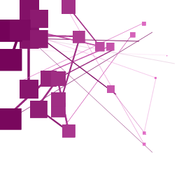

# pubkey-avis

Images generated by reading from a buffer of data.
Specifically intended for rendering pubkeys in a human-memorable form.

PRs are welcome (include screenshots!).
To work on it, add your algorithm to index.js, then update test.js and test.html to include your algorithm.
Build `test.build.js` with `browserify test.js > test.build.js`.

## current algorithms

### blockwork

input buffer: `5wOwICjSC0ekV2w6V2zDI+fcqCIxApRg3RIF9TNzWlk=`

### blockwild

input buffer: `5wOwICjSC0ekV2w6V2zDI+fcqCIxApRg3RIF9TNzWlk=`

### wildegraph

input buffer: `5wOwICjSC0ekV2w6V2zDI+fcqCIxApRg3RIF9TNzWlk=`

